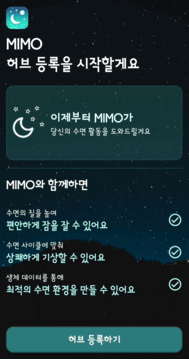
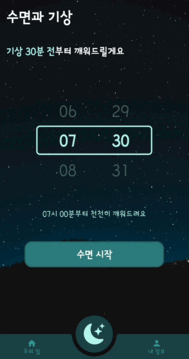
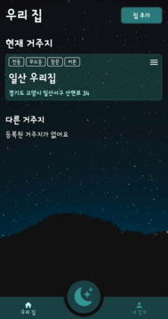
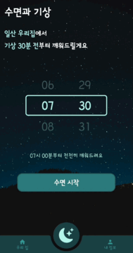
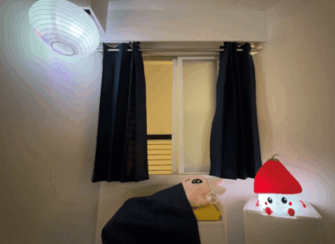

# 스마트슬립🌙 MIMO (Android Application)

MIMO는 갤럭시워치를 착용한 사용자가 "잘 자고 잘 일어날 수 있도록" 하는 IoT 서비스입니다.

앱은 갤럭시워치를 착용한 사용자의 **수면과 기상을 감지**하여 아래 일들을 수행합니다.

1. 수면 시 창문 닫기 / 커튼 치기 / 전등 끄기 / 무드등 끄기
2. 기상 시 창문 열기 / 커튼 걷기 / 전등 켜기 / 무드등 켜기

 

## 수행 기간 및 인원

- 2024년 4월 8일 ~ 2024년 5월 17일 (6주)
- **1인으로** 안드로이드 앱 개발 수행 (전체 팀원 6명)

 

## 언어 및 주요 기술 스택

- `Kotlin + Jetpack Compose`
- `Retrofit2`
- `헬스커넥트(갤럭시워치 + 삼성헬스 연동 라이브러리)`

 

## App 화면

  

    <h4>1. 초기 설정 퍼널</h4>
    <ul>
      <li>
        사용자는 허브(IoT 기기 여러 개를 제어하는 일종의 공유기)를 등록해야합니다.
      </li>
      <li>
        사용자가 허브에 붙어있는 QR코드를 스캔하여 허브를 등록합니다.
      </li>
      <li>
        허브를 세팅하고 메인화면으로 이동합니다.
      </li>
    </ul>
  

  

    

      
    

  

 

  

    <h4>2. 메인화면</h4>
    <ul>
      <li>
        <b>우리집</b> 화면에서는 유저의 집 목록을 렌더링합니다.
      </li>
      <li>
        <b>수면과 기상</b> 화면에서는 기상 시간을 설정하고 기상 30분 전 IoT 기기를 가동시킬 수 있습니다.
      </li>
      <li>
        <b>내 정보</b> 화면에서는 수면 통계를 볼 수 있습니다.
      </li>
    </ul>
  

  

    

      
    

  

 

  

    <h4>3. IoT 기기 조정화면</h4>
    <ul>
      <li>
        <b>조명, 전등</b> 을 토글 버튼으로 켜고, 끌 수 있습니다.
      </li>
      <li>
        <b>창문, 커튼</b> 의 열림, 닫힘 상태를 조절할 수 있습니다.
      </li>
    </ul>
  

  

    
  

 

  

    <h4>4. 수면과 기상</h4>
    <ul>
      <li>
        기상 시간을 정한 뒤 <b>수면 시작</b>을 눌러 수면 중 상태로 변경할 수 있습니다.
      </li>
      <li>
        <b>수면 중 상태</b>일 때는 기상 까지 남은 시간을 보여줍니다.
      </li>
      <li>
        <b>기상 30분 전 부터 알람이 울립니다.</b>
      </li>
      <li>
        <b>수면 중 상태</b>에서 핸드폰의 화면을 껐다 키면 무드등을 작동시킵니다.
      </li>
    </ul>
  

  

    
  

 

  

    <h4>5. 기타</h4>
    <ul>
      <li>
        <b>집 이름을 변경</b>할 수 있습니다.
      </li>
      <li>
        집에 등록된 허브 목록을 보여줍니다.
      </li>
      <li>
        새로운 허브, 집을 등록할 수 있습니다.
      </li>
    </ul>
  

  

    
  

 

## IoT 기능 시연 영상

  

    <h4>수면 시</h4>
    <ul>
      <li>
        조명과 전등이 꺼집니다.
      </li>
      <li>
        창문과 커튼이 닫힙니다.
      </li>
    </ul>
  

  

    
  

 

  

    <h4>기상 시</h4>
    <ul>
      <li>
        조명과 전등이 켜집니다.
      </li>
      <li>
        창문과 커튼이 닫힙니다.
      </li>
    </ul>
  

  

    
  

 

  

    <h4>수면 중간 핸드폰 사용</h4>
    <b>핸드폰 화면 켜짐을 감지</b>하여 무드등을 킵니다. 
  

  

    
  

